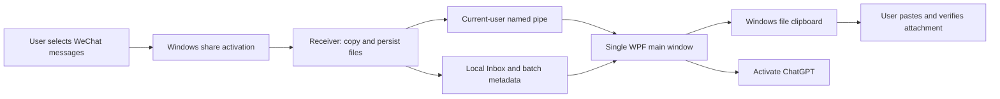

# Architecture

## Receiving

MSIX declares a `windows.shareTarget` for ZIP/TXT. WPF obtains the `ShareTargetActivatedEventArgs` and retains the live `ShareOperation` until files have been copied into the application's own inbox. The sender may provide temporary or on-demand files; their contents must be read before reporting completion.

Each batch has its own directory and each original file its own subdirectory. Metadata tracks receiving, saved and error states. ZIP inspection occurs after the original is saved and creates bounded text derivatives without extracting archive paths as local filenames. A failed derivative does not destroy the original.

## One main window

A named mutex identifies the primary process within the Windows user/session. Windows can still create a temporary process for a subsequent share. That process receives the files itself, sends a validated batch ID over a current-user named pipe, waits for acknowledgement and exits. It never serializes a live Windows share object to another process.

If the main process exits during receipt, the receiver may acquire the primary mutex and become the new main window. Disk metadata is the source of truth; notifications reduce latency. Directory changes are debounced, history is merged by ID and the user's current selection is preserved during passive refresh.

## Handoff

The app writes a Windows file-drop clipboard object and activates a configured destination. It does not simulate keystrokes or call private ChatGPT upload endpoints. The user pastes, verifies the attachment and sends a request. Target package identities and upload compatibility can change between application versions.

## Build and trust

Source, synthetic tests and packaging scripts are public. Local runtime data, research dumps, credentials, signing material and build products are outside the tracked source set. CI builds unsigned artifacts with read-only repository permissions. Signing and trusting a local development certificate are separate operations.

The installed receiver runs as a normal full-trust desktop application. File parsing and IPC are bounded defensively, but this does not isolate it from other processes running as the same user.
